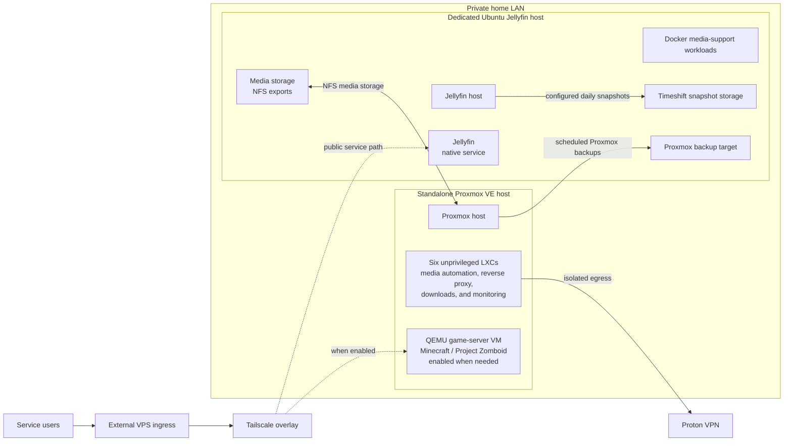

# Self-Hosted Infrastructure Environment

A compact, two-host self-hosted environment supporting media, automation, monitoring, and game services used by 20+ people over time. I operate and maintain the environment and document its architecture, operational decisions, and recovery history.

## Architecture

- **Standalone Proxmox VE host:** Debian-based virtualization host running six intentionally unprivileged LXC services and a QEMU game-server VM.
- **Dedicated Jellyfin host:** Ubuntu system running Jellyfin natively, attached media storage, NFS exports for Proxmox, and supporting Docker workloads.
- **Private LAN and overlay access:** The two hosts share a private LAN. Selected Jellyfin and game-server paths use an external VPS and Tailscale for public ingress; other services have no intentionally published inbound path.
- **Shared storage:** Media storage is served from the Jellyfin host to Proxmox over NFS. qBittorrent uses Proton VPN for its outbound path.

Public ingress is intentionally shown at a high level; detailed routing and reverse-proxy configuration are omitted from this overview.

## Major technologies

- Proxmox VE, LXC, QEMU, and LVM-thin storage
- Debian and Ubuntu Server
- Jellyfin, Docker, NFS, and attached HDD media storage
- Sonarr, Radarr, qBittorrent, SABnzbd, Seerr, Prowlarr, and Bazarr
- Tailscale overlay networking and Proton VPN workload egress
- Prometheus, Grafana, Prometheus PVE Exporter, and Node Exporter
- Timeshift system snapshots and scheduled Proxmox backups

## Operational responsibilities

- Operate physical hosts, virtual machines, unprivileged containers, and native/Docker services.
- Deploy and troubleshoot media, monitoring, storage, and network-connected workloads.
- Maintain cross-host NFS dependencies and overlay-based service access.
- Monitor capacity and service health, validate backups, and test recovery paths.
- Investigate incidents, improve failure behavior, and document known limitations without exposing credentials or unnecessary network details.

## Reliability and recovery work

- Recovered the Jellyfin host's root filesystem with Timeshift; core service downtime was approximately two hours.
- Remediated an NFS startup dependency so Proxmox and its LXCs can start in a degraded state when the media host is unavailable.
- Successfully restored the game-server VM from backup as a recovery test and salvaged readable data during a media-disk failure.
- Maintain local system snapshots and scheduled Proxmox backups; the replaceable bulk media archive remains intentionally single-copy.

## Documentation

- [Architecture overview](architecture/overview.md) · [Network architecture](architecture/network.md) · [Service placement](architecture/services.md)
- [Proxmox host](systems/proxmox.md) · [Jellyfin host](systems/jellyfin-server.md)
- [Monitoring](monitoring/overview.md) · [Backups](operations/backups.md) · [Disaster recovery](operations/disaster-recovery.md)
- Incidents: [Jellyfin root-filesystem recovery](operations/incidents/2026-01-jellyfin-root-filesystem-recovery.md) · [Proxmox/NFS startup dependency](operations/incidents/2026-07-proxmox-nfs-startup-dependency.md)
