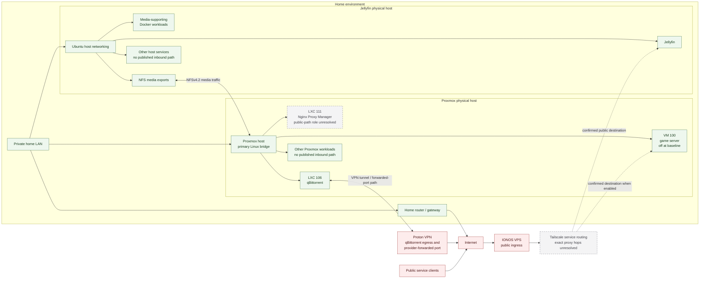

# Network Architecture

**Baseline verified:** 2026-10-01

## Scope

This document describes high-level connectivity without publishing exact addresses, domains, tunnel configuration, firewall rules, credentials, or provider-assigned ports. Detailed packet-filter policy and the complete reverse-proxy request path are not documented.

## Connectivity model

Nginx Proxy Manager is in LXC 111, but its participation in the VPS-to-service request path is unknown. The diagram therefore shows its placement without connecting it to an unverified routing relationship.

## Home LAN

Both physical hosts use wired interfaces on the same private `/24` LAN. The Proxmox uplink feeds a primary Linux bridge, with each active LXC connected through a virtual Ethernet interface. The Jellyfin host connects directly to the LAN and also exposes Docker bridge networks internally to that host.

Both hosts have Wi-Fi hardware, but their wireless interfaces were down at baseline. No VLAN topology is documented. The home router provides the default LAN path; its configuration, filtering policy, and DNS behavior are outside the documented scope.

### Internal service reachability

Services other than Jellyfin and the game-server path have no published inbound forwarding path. They may initiate outbound connections. The exposure model describes intended publication; implementation details remain unknown.

Internal-only or non-published services include the Proxmox management plane, monitoring components, media automation workloads, download automation, NFS, SSH administration, and the media-supporting Docker applications unless they are reached from an already authorized internal path.

Exact administrative reachability over Tailscale is not documented. Tailscale presence alone does not establish that every local listener is reachable by every overlay peer.

## Tailscale and public ingress

Tailscale interfaces are present on both physical hosts. Tailscale links public service paths to an IONOS VPS.

Two services are intentionally public-facing:

1. **Jellyfin** — public clients use a domain-based entry point that reaches the IONOS VPS, then traverses the Tailscale overlay toward the Jellyfin host.
2. **Video-game server** — VM 100 has a similar VPS/Tailscale public path when the VM and service are enabled. The VM was powered off at baseline.

During a historical 12-hour IONOS outage, about 10 of the environment's 20+ users temporarily retained Jellyfin access through a restricted, sanitized Tailscale path that did not depend on the unavailable normal VPS route. Their access returned promptly after they enabled the VPN; users without tailnet access remained affected until the normal path recovered. Exact peer policy and access details are intentionally omitted.

This design avoids relying on direct publication of the broader home LAN. Exact domains, public addresses, tunnel addresses, VPS listener configuration, and cryptographic material are intentionally omitted.

The complete sequence of reverse-proxy hops is still unknown. Nginx Proxy Manager is present, but its relationship to the VPS and each public service was not verified and is not asserted in the diagram.

## qBittorrent and Proton VPN

qBittorrent runs in unprivileged LXC 106. Its external connectivity has two deliberate properties:

- outbound qBittorrent traffic uses Proton VPN rather than the normal LAN egress path;
- qBittorrent is bound to the port forwarded by Proton VPN.

This is a workload-specific traffic-isolation decision. No VPN endpoint, address, credential, protocol configuration, firewall rule, or forwarded port number is recorded. Detailed leak-prevention or fail-closed behavior was not inspected and must not be assumed.

## NFS storage traffic

The Jellyfin host provides three NFSv4.2 media exports consumed by the Proxmox host. The Proxmox client mounts are read-write and use one internal source. This relationship is LAN-local and supports shared media access between the storage host and Proxmox-hosted workloads.

The exact export definitions, per-client permissions, and mapping of individual exports to LXC guests were not accessible. Architecture diagrams therefore show the relationship at host/bridge level rather than claiming direct mounts inside specific containers.

A storm-related power outage caused Proxmox to start before the Jellyfin/NFS host. All three mounts entered a persistent blocking state that affected the Proxmox web interface and media-management workloads. The host mount configuration was changed afterward to use `nofail` with a reduced timeout so unavailable NFS shares produce degraded behavior rather than blocking startup.

The remediation was tested by powering off the Jellyfin host. Proxmox and its LXCs started normally while media functions remained degraded until NFS returned. Automatic restart behavior and Wake-on-LAN procedures were also enabled for the Jellyfin host. NFS availability is now monitored through Prometheus and Grafana, although exact scrape and alert configuration remains unknown.

## Host-local container networking

The Jellyfin host had three active Docker bridges, three virtual Ethernet interfaces, and three Docker network namespaces supporting Seerr, Bazarr, and Prowlarr. Seerr's published listener was mapped directly; exact process-to-container mappings for Bazarr and Prowlarr remain unavailable. Container network names, address ranges, and detailed publication rules remain undocumented.

On Proxmox, six LXC virtual Ethernet interfaces were attached to the primary bridge. Docker/containerd processes were also visible inside the LXC process tree, indicating nested container activity, but the responsible guest and network design were not established.

## Traffic and exposure summary

| Source | Destination | Purpose | Exposure note |
|---|---|---|---|
| Public clients | IONOS VPS, then Jellyfin over Tailscale | Media access | Intentionally public; exact domain and endpoints omitted |
| Public clients | IONOS VPS, then VM 100 over Tailscale | Game access when enabled | Intentionally public; VM was off at baseline |
| Proxmox host | Jellyfin host | Three NFSv4.2 media mounts | Private LAN relationship |
| qBittorrent LXC | Proton VPN / Internet | Isolated application egress | Provider-forwarded port; details omitted |
| LAN clients | Internal applications and management services | Local service use and administration | No intentionally published inbound Internet path |
| Both physical hosts | Tailscale overlay | Overlay connectivity | Peer policy and complete reachability unknown |
| Approximately 10 trusted users | Restricted Tailscale path to Jellyfin | Temporary access during a 12-hour normal VPS-path outage | Access returned promptly after VPN activation; exact peers and policy omitted |
| Proxmox host | Jellyfin backup partition | Scheduled Proxmox backups | Internal storage path; filesystem path omitted here |

## Security boundaries and unknowns

The architecture establishes separation between private LAN traffic, Tailscale-based public paths, and qBittorrent's Proton VPN path. It does not establish:

- exact firewall or NAT rules;
- Tailscale ACLs or peer authorization;
- VPS reverse-proxy and TLS configuration;
- DNS provider or record design;
- whether Nginx Proxy Manager handles one or both public services;
- Docker publication policy beyond the current listeners;
- VLANs or other LAN segmentation;
- VPN fail-closed behavior for qBittorrent.

These items remain unknown or intentionally withheld.
