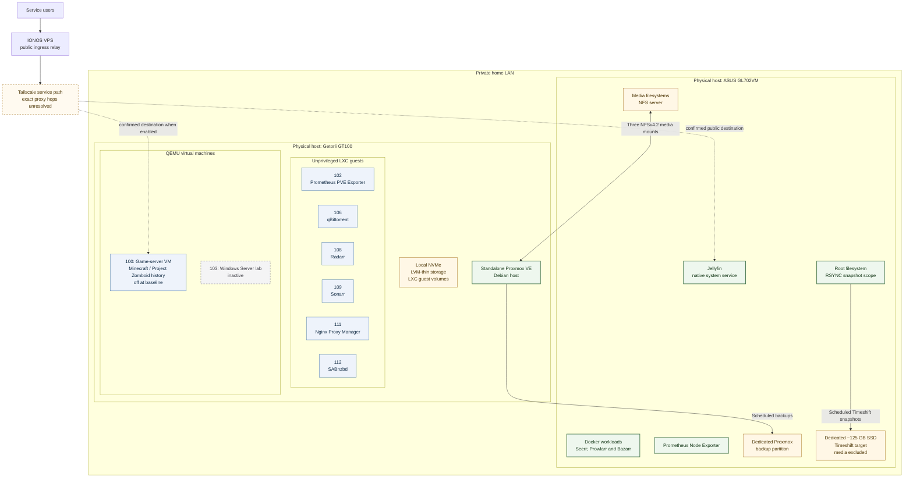

# Architecture Overview

**Baseline verified:** 2026-10-01

## Purpose

This environment provides self-hosted media, automation, monitoring, reverse-proxy, and game-server capabilities for real users. It is built around two physical systems on a private home LAN: a standalone Proxmox VE host and a dedicated Jellyfin media host.

## Physical and logical architecture

The diagram shows containment only where placement is established. The public traffic path is summarized here and described more carefully in [Network Architecture](network.md). Detailed reverse-proxy routing remains unknown.

## Physical systems

### Proxmox virtualization host

The Getorli GT100 is a standalone physical host running Proxmox VE 9 on Debian 13. It has an AMD Ryzen 5 3550H, approximately 12 GiB of RAM, a local NVMe device, and LVM-thin guest storage.

Its primary role is workload isolation and lifecycle management through six unprivileged LXC guests and two known QEMU VMs. All six LXCs were running at baseline. VM 100, the video-game server, was powered off because it was not currently needed. VM 103 is a dormant Windows Server lab and does not provide a current Active Directory service.

### Jellyfin media host

The ASUS GL702VM runs Ubuntu Server 24.04 and Jellyfin as a native system service. It provides the media-serving role, attached storage, NFS exports, and a Docker runtime for supporting media applications. The host also has an NVIDIA GTX 1060 Mobile GPU; whether Jellyfin currently uses GPU acceleration is unknown.

The media host is a shared infrastructure dependency. It supplies three media-storage NFS mounts to Proxmox and holds the dedicated partition used as the Proxmox backup target. This consolidation reduces hardware requirements but creates a dependency on the media host for shared storage and Proxmox backup availability.

## Workload model

The Proxmox host uses unprivileged LXCs for long-running, narrowly scoped services:

- monitoring export through LXC 102
- qBittorrent through LXC 106
- Radarr through LXC 108
- Sonarr through LXC 109
- Nginx Proxy Manager through LXC 111
- SABnzbd through LXC 112

Docker/containerd, Prometheus, Grafana, Node.js, and Python also appear within Proxmox-hosted LXC process trees, but their exact guest placement is unresolved. They are not assigned to a specific LXC or treated as separately identified services.

The two known QEMU workloads use complete guest operating systems. VM 100 provides the game-server environment and has hosted Minecraft and Project Zomboid. VM 103 supported historical Windows Server and domain-controller experimentation but is inactive and outside the current service scope.

On the Jellyfin host, Jellyfin remains a native service while supporting request and media-management applications use Docker. Seerr, Prowlarr, and Bazarr run through Docker; detailed container metadata and exact process-to-container mappings for Prowlarr and Bazarr are unavailable.

See [Service Placement](services.md) for the complete placement summary.

## Storage and data flow

The Proxmox host uses local LVM-thin storage for guest volumes and mounts three NFSv4.2 media exports from the Jellyfin host. These exports provide media storage. Exact export-to-guest mappings were not available, so individual LXC access to each export is not asserted.

The Jellyfin host combines its system disk with internal, portable, and external storage. Several media filesystems are intentionally near capacity because they hold archival media. The archive currently has no replica or backup because of budget constraints; the accepted recovery approach is to reacquire replaceable media if a disk fails.

System and configuration data receive separate protection:

- Timeshift is configured in RSYNC mode with seven retained daily system snapshots on a dedicated, separately mounted approximately 125 GB SSD. Large media filesystems and the replaceable downloads directory are excluded. An initial manual snapshot created on 2026-10-01 reported a size of approximately 52 GB.
- A Proxmox backup job is configured for 04:00 local time each day, targeting a dedicated partition on the Jellyfin host. Retention keeps the latest seven backups and four weekly backups.
- A currently media-filled portable SSD is planned for later use as additional backup storage.

Timeshift has successfully restored the operating system and important Jellyfin configuration/user files after a historical root-filesystem failure. Total service downtime was approximately two hours, and important data was preserved. Seerr, Bazarr, and Prowlarr configuration was copied manually during recovery and is now within Timeshift scope, but the current Docker configuration has not been separately restore-tested. The isolated restore-operation duration and a complete restored-file manifest remain unknown.

## Monitoring

Monitoring spans both physical hosts:

- LXC 102 runs the Prometheus PVE Exporter.
- Prometheus, Grafana, and `pve_exporter` run within the Proxmox-hosted LXC layer, but their precise guest placement is unresolved.
- Prometheus Node Exporter runs directly on the Jellyfin host.

These components provide host and Proxmox telemetry, but the complete scrape topology, dashboard ownership, alert routing, and retention design are not yet documented.

## Major design decisions and tradeoffs

### Separate compute orchestration from media serving

Virtualized services run primarily on Proxmox, while Jellyfin and bulk media storage remain on dedicated hardware. This keeps the media-serving path independent of routine LXC workload management and makes the laptop's local storage and GPU available to Jellyfin.

### Use unprivileged LXCs for service isolation

Each known Proxmox service has a dedicated unprivileged LXC, creating separate service lifecycle and container privilege boundaries rather than a single shared host deployment. At least one LXC also runs nested Docker workloads, but the exact placement is unresolved.

### Keep Proxmox standalone

The host is intentionally not clustered. This is appropriate to the available physical footprint and avoids representing installed HA-related services as a functioning multi-node HA design. The tradeoff is that there is no second Proxmox node for host-level failover.

### Centralize media storage on the Jellyfin host

Serving NFS from the media node lets Proxmox-hosted automation workloads share the archive without duplicating large data sets. It also makes the Jellyfin host a dependency for those mounts. After a power-event startup-order failure blocked Proxmox services and media workflows, host mounts were configured with `nofail` and reduced timeout behavior. A deliberate test with the Jellyfin host powered off confirmed that Proxmox and its LXCs now start in a degraded state rather than blocking. Current archive capacity and the absence of media replication are accepted constraints.

### Separate public ingress from the home edge

Jellyfin and the game-server path use Tailscale connectivity to an IONOS VPS for normal public access. During a historical 12-hour VPS outage, about 10 of the 20+ users restored Jellyfin access promptly through a restricted, sanitized Tailscale path after enabling the VPN; other users remained affected until the normal path recovered. Other services have no intentionally published inbound path. Exact DNS, reverse-proxy, firewall, peer-policy, and tunnel configuration is intentionally omitted and was not fully established.

### Isolate qBittorrent egress

qBittorrent uses Proton VPN for outbound traffic and is bound to the provider's forwarded port. This separates that workload's external traffic path from normal LAN egress. Sensitive VPN configuration is outside the documentation scope.

## Known architectural limits

The following points remain unresolved or intentionally omitted:

- Active Proxmox HA services do not imply a cluster; standalone operation is established.
- The complete public request path through Nginx Proxy Manager, the VPS, and Tailscale is not established.
- Exact firewall policy, DNS configuration, VLAN design, and application credentials are not documented.
- Prometheus and Grafana are present, but their exact LXC placement and full monitoring relationships remain unresolved.
- Media archive files are not currently backed up or replicated.
- Current application configuration inside powered-off VM 100 has not been inspected.
