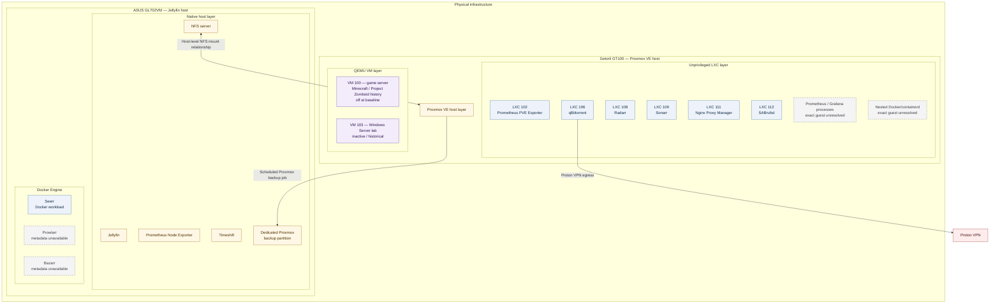

# Service Placement

**Baseline verified:** 2026-10-01

Known workloads are mapped to physical hosts and execution layers, distinguishing native host services, LXC containers, QEMU VMs, Docker workloads, and applications whose exact placement remains unresolved.

## Placement diagram

Prowlarr and Bazarr run through Docker, but detailed container metadata and exact process-to-container mappings are unavailable. Prometheus, Grafana, and nested Docker/containerd run within the Proxmox LXC layer; no specific LXC assignment is made.

## Proxmox physical host

The Getorli GT100 runs Proxmox VE as a standalone virtualization host. Six active, unprivileged LXCs provide the service workloads documented below.

### LXC workloads

| Guest | Workload | Layer | Baseline state | Architectural role |
|---|---|---|---|---|
| 102 | Prometheus PVE Exporter | Unprivileged LXC | Running | Exposes Proxmox telemetry to the monitoring system. |
| 106 | qBittorrent | Unprivileged LXC | Running | Uses Proton VPN for isolated outbound traffic and the provider-forwarded port. |
| 108 | Radarr | Unprivileged LXC | Running | Media-automation workload. |
| 109 | Sonarr | Unprivileged LXC | Running | Media-automation workload. |
| 111 | Nginx Proxy Manager | Unprivileged LXC | Running | Reverse-proxy component; exact position in public request routing is unknown. |
| 112 | SABnzbd | Unprivileged LXC | Running | Download-automation workload. |

The Jellyfin host provides three media NFS exports to Proxmox, but per-guest mount assignments were inaccessible. Several LXC applications participate in media workflows, but this document does not claim that each guest directly mounts every export.

### Unresolved Proxmox-hosted processes

Prometheus, Grafana, `pve_exporter`, Docker/containerd, Nginx, Node.js, and Python processes appear in LXC workloads, but their guest mapping is unresolved. Consequently:

- LXC 102 is documented with its Prometheus PVE Exporter role; Prometheus and Grafana are not assigned to it without additional placement data.
- nested Docker is documented as present somewhere in the LXC layer, not as a property of a named guest;
- generic Nginx, Node.js, and Python processes are not treated as additional independently placed services.

### QEMU virtual machines

| Guest | Workload | Layer | State/scope | Architectural role |
|---|---|---|---|---|
| 100 | Game server | QEMU VM | Powered off at baseline; only VM currently in use | Has hosted Minecraft and Project Zomboid. Current in-guest application configuration is not documented. |
| 103 | Windows Server lab | QEMU VM | Inactive; not used recently | Historical lab for domain-controller and other Windows Server testing. It is outside the current service scope and does not represent active Active Directory. |

The documentation includes VM 100 and VM 103. Proxmox ACL restrictions prevented a complete guest enumeration, so it does not assert that these are the only configured VMs.

## Jellyfin physical host

The ASUS GL702VM combines native media-serving and storage services with a small Docker application layer.

### Native host services

| Service | Layer | Architectural role |
|---|---|---|
| Jellyfin | Native systemd service | Primary media-serving application and one of two intentionally public-facing service paths. |
| NFS server | Native host service | Supplies three media-storage mounts to the Proxmox host. Exact export definitions are intentionally not documented. |
| Prometheus Node Exporter | Native systemd service | Provides host telemetry. Scrape target configuration and alert relationships are unknown. |
| Tailscale | Native host service | Connects the host to the overlay used by the IONOS VPS public ingress path. |
| Docker Engine / containerd | Native runtime | Runs three container workloads, network namespaces, and related bridges. Detailed container metadata is unavailable. |
| Timeshift | RSYNC-mode system snapshot mechanism | Configured for daily snapshots with retention of seven on a dedicated, separately mounted approximately 125 GB SSD. Large media filesystems and the replaceable downloads directory are excluded. A manual snapshot reported approximately 52 GB; historical OS and Jellyfin configuration/user-file restoration succeeded. |

Jellyfin runs directly on the host rather than through Docker. The NVIDIA GPU is present, but current Jellyfin hardware-transcoding use is not documented.

### Docker workloads

| Workload | Layer | Architectural role |
|---|---|---|
| Seerr | Docker workload | Media-request aggregator used by the service user community. |
| Prowlarr | Docker workload; detailed metadata unavailable | Media indexer-management application. |
| Bazarr | Docker workload; detailed metadata unavailable | Subtitle-management application. |

Three container shims, Docker bridges, veth interfaces, and network namespaces support these applications. Seerr's published listener was mapped directly; exact process-to-container mappings for Prowlarr and Bazarr remain unavailable. Container images, versions, health checks, volume mappings, and network names remain unknown.

## Shared and external services

| Component | Placement | Relationship |
|---|---|---|
| IONOS VPS | External hosted system | Provides public ingress connectivity over Tailscale for Jellyfin and VM 100 when enabled. Its software stack is unknown. |
| Proton VPN | External VPN provider | Carries qBittorrent external traffic and supplies its forwarded-port path. Configuration details are intentionally omitted. |
| Proxmox backup target | Dedicated partition on Jellyfin host | Target for a backup job scheduled at 04:00 local time each day; retention keeps the latest seven and four weekly backups. Public documentation omits the local mount path. |
| Media archive | Filesystems attached to Jellyfin host | Shared to Proxmox over NFS. It currently has no backup or replica because of budget constraints. |

## Service relationships

### Media request and automation

Seerr is the user-facing request aggregator. Radarr, Sonarr, Prowlarr, Bazarr, SABnzbd, qBittorrent, Jellyfin, and shared media storage form the broader media service set. Their placement is described above; API integrations, queue flows, credentials, and exact filesystem handoffs remain unknown.

Large media HDD filesystems are outside Timeshift scope, and the replaceable completed-downloads directory is explicitly excluded. The exact service-to-directory sequence, staging location, and mount mappings are not established. Seerr, Bazarr, and Prowlarr configuration files were copied manually during recovery and are within current Timeshift scope, but their current presence was not independently inspected and the current Docker configuration has not been separately restore-tested.

### Monitoring

The known monitoring components are:

- Prometheus PVE Exporter in LXC 102;
- Prometheus and Grafana processes somewhere in the Proxmox-hosted LXC layer;
- Prometheus Node Exporter on the Jellyfin host.

The exporter, collector, and dashboard roles suggest a conventional telemetry flow. Exact scrape targets, ports, retention, dashboards, alerting, and the complete monitoring pipeline remain unknown.

### Reverse proxy and public services

Nginx Proxy Manager runs in LXC 111. Jellyfin and VM 100 are the only services confirmed as intentionally public-facing, using the IONOS VPS and Tailscale. The exact role of LXC 111 in either path remains unknown. Other services have no published inbound forwarding path, although they retain outbound connectivity.

### Backup services

- Jellyfin host: Timeshift in RSYNC mode, configured for daily system snapshots with retention of seven on a dedicated approximately 125 GB SSD. Large media filesystems and the replaceable downloads directory are excluded. An initial manual snapshot created on 2026-10-01 reported approximately 52 GB.
- Proxmox: backup job configured for 04:00 local time each day to the dedicated Jellyfin-host partition, keeping the latest seven and four weekly backups.
- Media archive: no backup or replica at present; reacquisition is the accepted recovery approach for replaceable content.
- Portable SSD: currently contains media and is intended for future backup use, but that future role is not documented as a current capability.

Timeshift successfully restored the operating system and important Jellyfin configuration/user files during a historical root-filesystem recovery. Docker configuration was copied manually during that incident and is now within Timeshift scope, but has not been separately restore-tested. VM 100 was also successfully restored from Proxmox backup as a test. Isolated restore timing and broader recovery validation remain unknown.

## Placement limitations

The following details remain unresolved or intentionally omitted:

- exact LXC placement of Prometheus, Grafana, and nested Docker;
- detailed Proxmox guest configuration beyond the documented mappings;
- current Minecraft and Project Zomboid installation/configuration inside powered-off VM 100;
- Prowlarr and Bazarr container metadata;
- per-guest NFS mount mapping;
- Nginx Proxy Manager's exact request-routing role;
- application versions, credentials, secrets, and detailed configuration.
