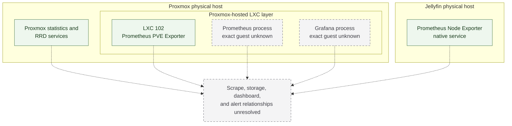

# Monitoring Overview

**Baseline date:** 2026-10-01

## Scope

The monitoring footprint includes Prometheus, Grafana, a Prometheus PVE Exporter workload, Proxmox host telemetry services, and Prometheus Node Exporter on the Jellyfin host. The complete Prometheus architecture is not yet mapped: exact scrape relationships, component versions, configuration, retention, dashboards, alert rules, and notification paths remain unknown.

## Known components

| Component | Known placement | What is known |
|---|---|---|
| Prometheus PVE Exporter | Unprivileged Proxmox LXC 102 | The guest was running at baseline and provides the identified Proxmox exporter workload. |
| `pve_exporter` process | Proxmox-hosted LXC process tree | The exact guest mapping is unresolved beyond the LXC 102 exporter role. |
| Prometheus | Somewhere in the Proxmox-hosted LXC layer | Its guest, configuration, targets, and data path are unknown. |
| Grafana | Somewhere in the Proxmox-hosted LXC layer | Its guest, data source configuration, dashboards, and access path are unknown. |
| Proxmox statistics services | Proxmox physical host | Proxmox statistics and RRD-related services were active, including host statistics collection and RRD caching components. |
| Prometheus Node Exporter | Jellyfin physical host | Runs as an active system service; scrape configuration is not yet documented. |
| NFS availability coverage | Prometheus/Grafana relationship unresolved | Monitoring was added after a historical NFS startup-dependency incident. Exact metric source, dashboard, threshold, and notification behavior are unknown. |

## Placement model

The dashed edges do not represent scrape flows. They show that each component's relationship to the end-to-end monitoring design remains unresolved.

## Proxmox telemetry

The Proxmox host runs platform statistics services, RRD caching, and status daemons. LXC 102 provides the Prometheus PVE Exporter workload.

The platform-native telemetry and a Prometheus-compatible exporter are present. The following remain unknown:

- which Proxmox API endpoint or account the exporter uses;
- what permissions or collection scope are configured;
- whether the exporter is currently scraped successfully;
- whether host, guest, storage, or cluster metrics are retained;
- whether any exporter errors or stale series exist.

The host is intentionally standalone; active Proxmox HA-related units do not provide cluster monitoring coverage.

## Jellyfin host telemetry

Prometheus Node Exporter runs directly on the Jellyfin physical host. This provides an operating-system telemetry endpoint, but the data path beyond it is unknown.

Node Exporter flags, enabled collectors, filtering, authentication, and scrape status are unknown. Application-level Jellyfin metrics are also unknown. GPU hardware and an NVIDIA persistence service are present, but no GPU exporter or GPU monitoring integration is documented.

Storage utilization is operationally important on this host because several media filesystems are intentionally near capacity. No monitoring threshold, alert, or dashboard for those filesystems is currently documented.

NFS availability is now monitored through Prometheus and Grafana after a historical outage. The metric source, scrape target, dashboard implementation, alert threshold, and notification delivery are unknown.

## Prometheus and Grafana

Prometheus and Grafana run within the Proxmox-hosted LXC layer, but their specific guest placement is not yet documented. LXC 102 is assigned to the PVE Exporter; Prometheus and Grafana are not assigned to it without additional placement information.

The following remain unknown:

- whether Prometheus and Grafana share a guest;
- whether Grafana uses this Prometheus instance as a data source;
- whether either component is persistent, redundant, backed up, or externally accessible;
- whether dashboards cover both physical hosts or all workloads;
- whether alerting is configured.

## Coverage status

| Monitoring concern | Status |
|---|---|
| Component presence | Prometheus, Grafana, PVE Exporter, Proxmox telemetry services, and Jellyfin Node Exporter present |
| Exact component placement | PVE Exporter and Node Exporter mapped; Prometheus and Grafana unresolved |
| Scrape topology | Unknown |
| Target health | Current state unknown; NFS availability coverage is in place, but implementation details are unknown |
| Metric retention | Unknown |
| Dashboard inventory | Unknown |
| Alert rules and thresholds | Unknown |
| Notification delivery | Unknown |
| Monitoring authentication | Not inspected and intentionally not documented |
| Monitoring backup/recovery | Unknown |
| Availability or redundancy | Unknown |

Successful scrapes, dashboard rendering, alert delivery, and monitoring restoration remain unverified.

## Operational considerations

- **Placement ambiguity:** troubleshooting Prometheus or Grafana requires first identifying the responsible LXC without assuming it is LXC 102.
- **Single-node context:** Proxmox telemetry describes a standalone host, not a multi-node cluster.
- **Capacity interpretation:** high media-filesystem utilization is expected archive behavior, so useful alerting would need to distinguish accepted fullness from unexpected system or staging-volume growth. No such policy is currently documented.
- **Exporter presence versus coverage:** a running exporter demonstrates an endpoint, not successful collection or alerting.
- **NFS coverage:** NFS availability is monitored through Prometheus and Grafana, but alert-delivery and dashboard behavior are unknown.
- **Monitoring dependency chain:** a complete dependency graph cannot be documented until scrape targets, storage, dashboards, and notification paths are verified.

## Open questions

Material unknowns are:

1. the LXC placement of Prometheus and Grafana;
2. Prometheus scrape targets and current target health;
3. Grafana data sources and dashboard inventory;
4. metric retention and storage location;
5. alert rules, thresholds, and notification paths;
6. monitoring access boundaries and availability expectations;
7. whether monitoring configuration or data is included in current backups.

These require further documentation before a conventional Prometheus deployment model can be described.
