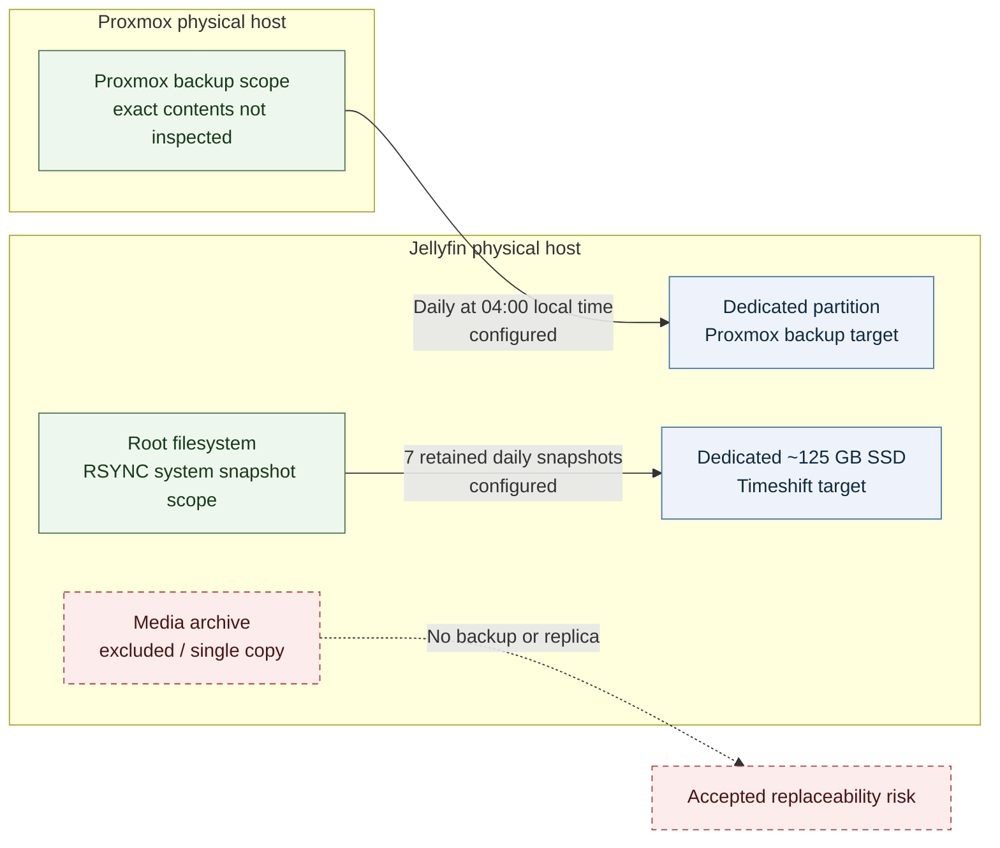

# Backup Strategy

**Baseline date:** 2026-10-01

## Scope

The environment has two backup mechanisms:

1. Timeshift RSYNC-mode system snapshots configured daily for the Jellyfin physical host;
2. a Proxmox backup job configured to run daily against storage on the Jellyfin host.

The media archive is intentionally excluded from backup and currently has no replica. The sections below distinguish configured schedules and scope from confirmed execution, known contents, and tested restoration. An approximately 52 GB manual Timeshift snapshot exists, and two specific historical recovery events succeeded: a Jellyfin-host restore and a VM 100 restore test. Backup logs, artifacts, and restoration records have not yet been reviewed.

No recovery point objective (RPO), recovery time objective (RTO), successful-run rate, or generalized recovery capability is defined. The restore outcomes below apply only to those specific events.
## Backup architecture

## Backup summary

| Source | Mechanism and schedule | Target | Retention | Exclusions | Current status |
|---|---|---|---|---|---|
| Jellyfin physical host | Timeshift in RSYNC mode, configured daily | Dedicated, separately mounted approximately 125 GB SSD | 7 daily snapshots | Large media HDD filesystems and an explicitly excluded completed-downloads directory | Configuration and an approximately 52 GB manual snapshot are in place; a historical OS/Jellyfin configuration restore succeeded, but current file-level contents remain unverified |
| Proxmox environment | Proxmox backup job, daily at 04:00 local time | Dedicated partition on the Jellyfin host | Latest 7 plus 4 weekly | Unknown | Schedule, target, and retention are configured; a VM 100 restore test succeeded, but current execution history and complete job scope were not inspected |
| Media archive | No current backup | None | Not applicable | Entire archive is outside the protected data set | No replication or backup; this risk is accepted |

Exact internal mount paths, storage identifiers, job configuration, credentials, and backup filenames are intentionally omitted.

## Jellyfin Timeshift strategy

### Configuration and intended scope

Timeshift is configured in RSYNC mode for Jellyfin-host system snapshots. Daily snapshots are enabled with retention of seven daily snapshots. The target is a dedicated, separately mounted SSD of approximately 125 GB. Its UUID, device identifier, and exact mount path are intentionally omitted.

The large media HDD filesystems are outside snapshot scope. The completed-downloads directory is explicitly excluded and contained approximately 578 GB of replaceable downloaded media at baseline. The root filesystem contained approximately 639 GB before exclusions, with the overwhelming majority attributable to that excluded directory. The exact exclusion path is retained in the internal inventory but omitted here because the architectural relationship is sufficient for public documentation.

This describes the configured snapshot scope, not a verified file-level manifest. Seerr, Bazarr, and Prowlarr configuration files are included in Timeshift scope, but their presence was not independently inspected and the current Docker configuration has not been separately restore-tested.

### Current status

| Question | Current status |
|---|---|
| Mode configured | RSYNC |
| Schedule configured | Daily |
| Retention configured | 7 daily snapshots |
| Target configured | Dedicated approximately 125 GB SSD |
| Initial manual execution | Snapshot created on 2026-10-01; size approximately 52 GB |
| Snapshot artifacts independently inspected | No |
| Included files verified | Historical restore verified the OS and important Jellyfin configuration/user files; current file-level manifest not verified |
| Media exclusions | Large media filesystems outside scope; completed-downloads directory explicitly excluded |
| Docker persistent state | Seerr, Bazarr, and Prowlarr configuration inclusion is configured; not independently inspected or separately restore-tested |
| Restore performed | Yes; successful historical root-filesystem recovery |
| Incident downtime | Approximately 2 hours total |
| Data outcome | Important data preserved |
| Isolated restore-operation duration | Unknown |

The daily schedule expresses intended snapshot frequency. The historical restore recovered the OS and important Jellyfin configuration/user files in that incident; it does not establish a current daily recovery point. Docker configuration was copied manually during that incident; its current Timeshift inclusion is configured but not separately restore-tested.

## Proxmox backup strategy

### Schedule and retention

The Proxmox backup job has the following policy:

- is scheduled daily at **04:00 local time**;
- targets a dedicated partition on the Jellyfin physical host;
- keeps the latest seven backups;
- keeps four weekly backups.

The schedule is documented in host-local time because the underlying job is not known to be pinned to a fixed time zone.

### Scope and target

The target is physically separate from the Proxmox NVMe device but remains inside the same local two-host environment. The target's internal path is intentionally omitted.

The authoritative Proxmox configuration and exact backup selection were not inspected. It is therefore unknown whether every LXC, VM, host configuration item, or stopped guest is included. The existence of VM 100 and dormant VM 103 does not show that either appears in the job selection.

### Current status

| Question | Current status |
|---|---|
| Schedule configured | Daily at 04:00 local time |
| Target configured | Dedicated Jellyfin-host partition |
| Retention configured | Latest 7 plus 4 weekly |
| Recent successful executions confirmed | Current job history not yet reviewed |
| Backup artifacts inspected | Not inspected directly |
| Guest selection verified | VM 100 is known to have been recoverable; complete selection remains unknown |
| Backup integrity checks verified | Unknown |
| Guest restore performed | VM 100 successfully restored as a test; expected state recovered |
| Restore duration | Unknown |

Configured retention limits the intended on-target history. The VM 100 test demonstrates restoration for that guest, but does not show successful creation, pruning, integrity, or restorability for every configured guest.

## Media archive risk acceptance

The high-capacity media filesystems currently contain the only copies of the media archive. They are not protected by Timeshift, the Proxmox backup job, or another established replica.

This is a budget-driven risk decision. The content is considered replaceable, and reacquisition is the accepted response to media-disk data loss. “Replaceable” does not mean recovery would be immediate: reacquisition and library reconstruction would require time and effort.

Several media filesystems were intentionally near capacity at baseline. Their utilization is expected archival behavior, but the absence of another copy means an individual storage failure may cause data loss even when system/configuration backups remain available.

During a historical media-disk failure, the disk was attached to an Ubuntu Server live environment and non-corrupted files were copied to a rescue drive. This demonstrates partial file salvage in that incident, not complete archive recoverability. Reacquisition remains the recovery strategy for missing or corrupted replaceable media.

A portable SSD currently holds media and is planned for future additional backup use. That planned role is not counted as current protection.

## Locality and failure domains

Both documented backup targets are associated with the Jellyfin physical host:

- Timeshift writes to a dedicated, separately mounted approximately 125 GB SSD;
- Proxmox writes to a dedicated partition on the Jellyfin node.

This provides separation from the Proxmox system disk, but not from all local failure domains. Depending on the event, loss of the Jellyfin host, attached storage, power, local network, or physical site could affect one or both targets. Whether the Timeshift SSD and Proxmox target share a lower-level device or failure boundary has not been established and is not assumed.

No off-site, cloud, or geographically separate backup is in place. None should be assumed.

## Dependencies

| Dependency | Backup impact |
|---|---|
| Jellyfin physical host | Hosts the Proxmox target and runs the Timeshift-protected system |
| Dedicated approximately 125 GB SSD | Holds Timeshift RSYNC-mode snapshots |
| Dedicated Jellyfin-host partition | Receives Proxmox backups; relationship to the Timeshift SSD is not established |
| Private home LAN | Required for Proxmox to reach its remote target |
| Source-system availability | Required for scheduled jobs unless the mechanism supports otherwise; exact behavior was not inspected |

## What is protected and what is not

### Protected by documented configuration

- The Jellyfin root filesystem within the configured Timeshift RSYNC snapshot scope, subject to explicit exclusions and successful snapshot completion.
- The Proxmox backup job's selected scope, whatever that detailed selection contains, through the configured schedule and retention.

### Explicitly excluded or unprotected

- the large media archive HDD filesystems;
- the explicitly excluded completed-downloads directory;
- any Proxmox guest or host data not selected by the backup job;
- any state created after the latest successful backup, if successful backups exist;
- off-site copies, because no off-site mechanism is established.

### Not yet verified

- independently inspected contents of the approximately 52 GB manual Timeshift snapshot;
- independent verification of Seerr, Bazarr, and Prowlarr configuration in a completed snapshot;
- complete Proxmox guest/job selection;
- presence and freshness of scheduled backup artifacts;
- retention pruning behavior;
- artifact integrity beyond the successful historical restores;
- repeatable restoration procedures and isolated operation timing beyond the approximately two-hour total historical incident downtime.

## Open operational checks

The backup configuration is better understood than backup execution or recovery capability. Open checks are:

1. verify current scheduled-job status and recent successful executions without exposing backup contents;
2. confirm complete Proxmox guest selection, including treatment of stopped VMs;
3. independently verify Seerr, Bazarr, and Prowlarr configuration in a completed Timeshift snapshot;
4. inspect age and count of sanitized backup artifacts and retention behavior;
5. record repeatable, sanitized procedures from the successful historical restore experiences;
6. record restore duration during future controlled validation before making recovery-time guarantees.

These checks remain outstanding; their absence does not establish failure.

## Current limits

The following remain unknown or untested:

- RPO or RTO;
- backup success rate;
- last successful execution;
- complete backup manifests;
- cryptographic or application-level integrity validation;
- isolated restore-operation timing and any generalized recovery-time expectation;
- tested bare-metal or LXC recovery;
- generalized VM recovery beyond the successful VM 100 test;
- recovery of the current Seerr, Bazarr, and Prowlarr configuration from Timeshift;
- off-site protection;
- media archive recoverability beyond reacquisition.
